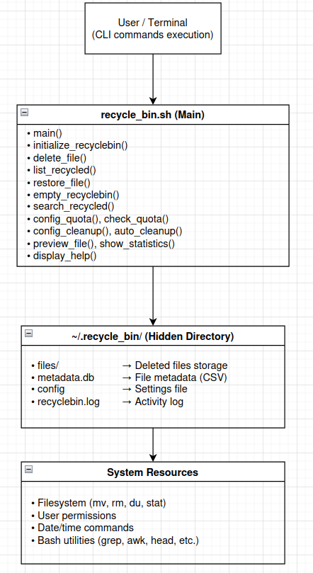
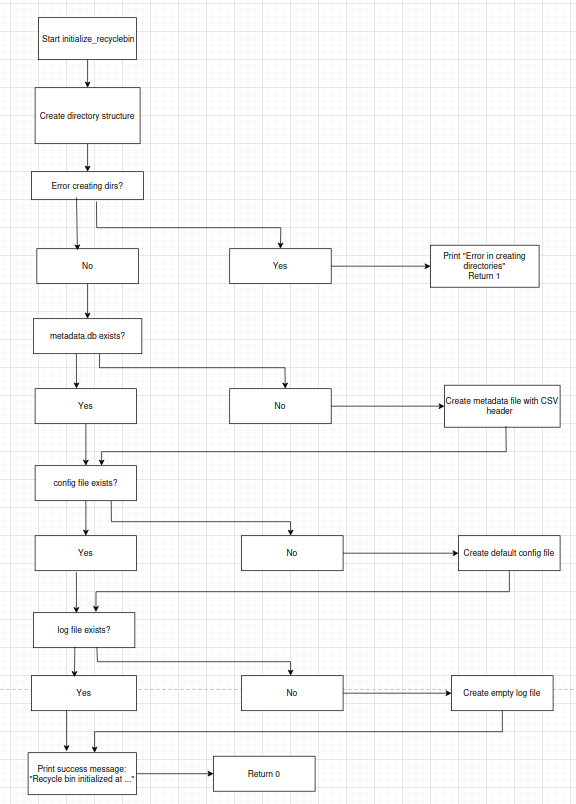
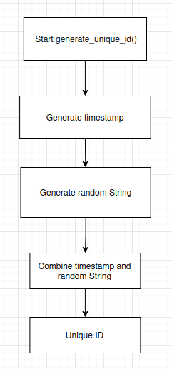
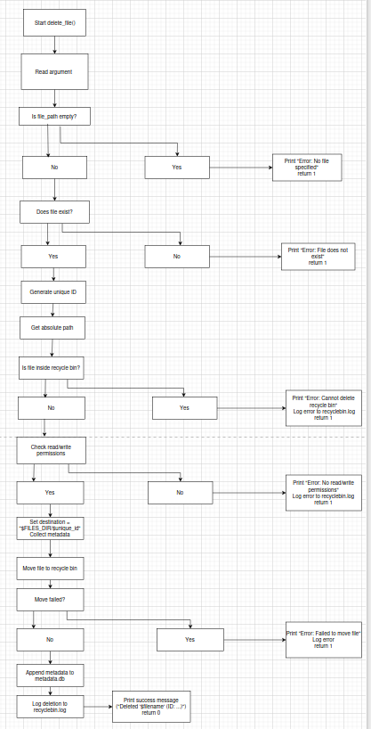
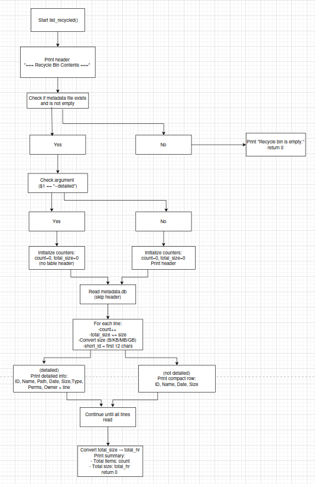
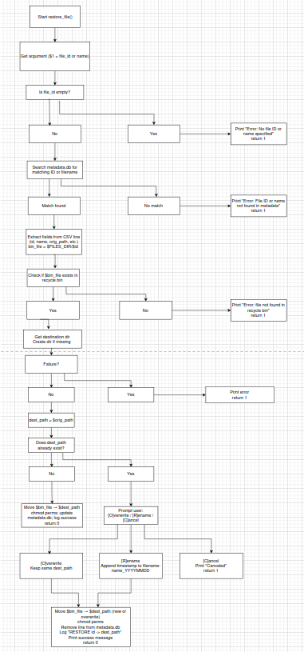
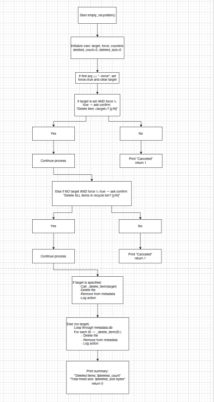
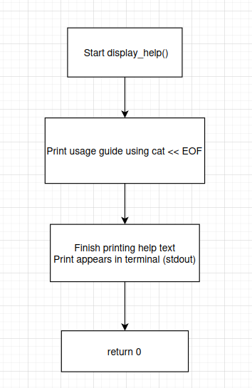

# Technical Documentation

- System architecture diagram
- Data flow diagrams/Flowcharts for complex operations
- Metadata schema
- Function descriptions
- Design decisions & rationale
- Algorithm explanations

# System architecture diagram

The following diagram represents the internal structure of the Linux Recycle Bin system,
showing the relationship between the main script, its functions, the configuration files,
and the system resources used.

# Data flow diagrams/Flowcharts for complex operations

**`initialize_recyclebin()`**

Creates all the necessary recycle bin structure, including main directories and files (files/, metadata.db, config, recyclebin.log), and defines default settings such as maximum size and file retention time.

**`generate_unique_id()`**

Generates a unique identifier for each deleted file by combining the current timestamp with a random alphanumeric string, ensuring uniqueness within the recycle bin.

**`delete_file()`**

Moves files or directories to the recycle bin, stores their information in metadata.db, and logs the operation in recyclebin.log. It also checks permissions, prevents deletion of the recycle bin itself, and enforces space limits through the check_quota() function.

**`list_recycled()`**

Displays all files currently in the recycle bin in a formatted table. Supports a detailed mode (--detailed) that shows extended metadata such as file size, type, permissions, and owner.

**`restore_file()`**

Restores files from the recycle bin to their original locations, prompting the user for confirmation if a naming conflict occurs. It restores original permissions and removes the corresponding metadata entry.

**`empty_recyclebin()`**

Permanently deletes files from the recycle bin, either individually or all at once, with optional confirmation or using the --force flag. It also removes corresponding entries from the metadata file and updates the log.

**`search_recycled()`**

Searches for files within the recycle bin by name or pattern, supporting case-insensitive searches (--ignore-case). Displays formatted results including file ID, name, original path, and deletion date.

**`display_help()`**

Displays a complete usage guide with all available commands, flags, examples, and current configurations, serving as a built-in user reference.

# Metadata schema

The recycle bin system uses a metadata file **(metadata.db)** to keep track of all deleted items.

This file is stored in the directory **~/.recycle_bin/** and acts as a lightweight database in CSV (Comma-Separated Values) format. 

Each line corresponds to one deleted file or directory and stores all relevant information needed for restoration, listing, and cleanup operations.

The schema is automatically created by the initialize_recyclebin() function with the following header: ID,ORIGINAL_NAME,ORIGINAL_PATH,DELETION_DATE,FILE_SIZE,FILE_TYPE,PERMISSIONS,OWNER

| **Field Name**  | **Description**                                                                         | **Data Type** | **Example**                      |
| --------------- | --------------------------------------------------------------------------------------- | ------------- | -------------------------------- |
| `ID`            | Identificador único gerado para cada ficheiro eliminado (timestamp + string aleatória). | String        | `1730038210_ab12cd`              |
| `ORIGINAL_NAME` | Nome original do ficheiro ou diretório.                                                 | String        | `report.pdf`                     |
| `ORIGINAL_PATH` | Caminho absoluto onde o ficheiro se encontrava antes da eliminação.                     | String        | `/home/gui/Documents/report.pdf` |
| `DELETION_DATE` | Data e hora em que o ficheiro foi eliminado.                                            | String        | `2025-10-27 14:32:18`            |
| `FILE_SIZE`     | Tamanho do ficheiro em bytes no momento da eliminação.                                  | Integer       | `20480`                          |
| `FILE_TYPE`     | Tipo do item eliminado: `file`, `directory` ou `symlink`.                               | String        | `file`                           |
| `PERMISSIONS`   | Permissões originais do ficheiro no formato octal (ex: `644`).                          | Integer       | `644`                            |
| `OWNER`         | Dono e grupo do ficheiro no formato `utilizador:grupo`.                                 | String        | `gui:users`                      |

# Function descriptions

This section documents the project's main functions. Each function block contains: purpose, location, expected inputs/outputs, likely errors, side effects and notes.

### initialize_recyclebin()
- Purpose: Initialize the recycle bin structure (create essential directories and files).
- Location: `recycle_bin.sh`
- Inputs: none (performs initial setup).
- Outputs: directories and files created (e.g. `files/`, `metadata.db`, `config`, `recyclebin.log`).
- Errors: insufficient permissions when creating files/dirs.
- Side effects: modifies the user's filesystem where the recycle bin is created.
- Notes: idempotent — can be called again without corrupting existing data.

### generate_unique_id()
- Purpose: Generate a unique identifier for removed items.
- Location: `recycle_bin.sh`
- Inputs: (internal) timestamp + counter/random component.
- Outputs: unique ID string.
- Errors: collisions are extremely unlikely; conflicts handled by existence checks.
- Notes: used to name files in the recycle bin internal storage.

### delete_file()
- Purpose: Move files or directories to the recycle bin and record metadata.
- Location: `recycle_bin.sh`
- Inputs: path of the file/dir to delete, flags (e.g. `--recursive`).
- Outputs: entry added to `metadata.db`, file moved to `files/` under its ID.
- Errors: missing permissions, invalid path, attempt to delete the recycle bin itself.
- Side effects: may trigger `check_quota()` to manage storage space.
- Notes: validates input and logs the operation.

### list_recycled()
- Purpose: Display items currently in the recycle bin.
- Location: `recycle_bin.sh`
- Inputs: display flags (e.g. `--detailed`, filters).
- Outputs: formatted list (ID, name, original path, date, size).
- Errors: failed read of `metadata.db`.
- Notes: output is pipe-friendly for filtering.

### restore_file()
- Purpose: Restore an item from the recycle bin to its original path.
- Location: `recycle_bin.sh`
- Inputs: item ID or selection/path, conflict flags (e.g. `--overwrite`).
- Outputs: file restored to original location; corresponding metadata entry removed.
- Errors: destination missing, insufficient permissions, name conflict if not using `--overwrite`.
- Side effects: modifies the filesystem outside the recycle bin.
- Notes: prompts for confirmation by default on conflict.

### empty_recyclebin()
- Purpose: Permanently remove items from the recycle bin (all or selected).
- Location: `recycle_bin.sh`
- Inputs: `--force` to skip prompts, optional ID(s).
- Outputs: files removed from disk, metadata entries deleted.
- Errors: removal failure due to permissions or file-in-use.
- Notes: destructive operation — use with caution.

### _delete_item()
- Purpose: Internal helper function to delete a specific item.
- Location: `recycle_bin.sh`
- Inputs: item ID to delete.
- Outputs: file removal and metadata update.
- Notes: underscore prefix denotes internal use; not intended to be called from the CLI.

### search_recycled()
- Purpose: Search items in the recycle bin by name or pattern.
- Location: `recycle_bin.sh`
- Inputs: search term, flags (`--ignore-case`).
- Outputs: filtered list of results (ID, name, path, date).
- Errors: failed metadata read.

### config_quota() / check_quota()
- Purpose: Define and verify the recycle bin size limit; `check_quota()` removes oldest items when necessary.
- Location: `recycle_bin.sh`
- Inputs: new quota value (KB/MB/GB) for `config_quota()`; `check_quota()` is normally invoked internally.
- Outputs: configuration adjustments; automatic removals when quota exceeded.
- Notes: policy-first — removes by age to reclaim space.

### config_cleanup() / auto_cleanup()
- Purpose: Configure and run periodic age-based cleanups.
- Location: `recycle_bin.sh`
- Inputs: number of retention days; `auto_cleanup()` uses the configuration to perform removals.
- Outputs: older items permanently removed.

### preview_file()
- Purpose: Show a preview of an item stored in the recycle bin.
- Location: `recycle_bin.sh`
- Inputs: item ID, number of lines for text preview.
- Outputs: initial lines of the file or a summary of type/content.

### show_statistics()
- Purpose: Present statistics (number of files, space used, quotas).
- Location: `recycle_bin.sh`
- Inputs: output flags (e.g., `--json`).
- Outputs: human-readable report with aggregated values.

### load_config()
- Purpose: Load configuration values from the script's config file.
- Location: `recycle_bin.sh`
- Inputs: path to the `config` file (optional).
- Outputs: internal variables populated with loaded values.

### display_help()
- Purpose: Display the user manual/help with commands and options.
- Location: `recycle_bin.sh`
- Inputs: none.
- Outputs: help text printed to stdout.

### main()
- Purpose: Entry point that parses arguments and dispatches to the appropriate functions.
- Location: `recycle_bin.sh`
- Inputs: CLI arguments.
- Outputs: result of the invoked operation; exit code (0/!=0).

# Design decisions and rationale

### Quota and Cleanup Mechanisms

To prevent the recycle bin from growing indefinitely, two control mechanisms were introduced:

**check_quota()** — automatically deletes the oldest files when the maximum size is exceeded.

**auto_cleanup()** — permanently deletes files older than a configured number of days.
These decisions balance storage efficiency and data retention reliability.

### Configurable System

A configuration file `(config)` was implemented to allow user-defined limits on bin size `(MAX_SIZE_KB)` and file retention time `(NUMBER_OF_DAYS)`. 

This enables customization without altering the script, improving usability and adaptability.

# Algorithm explanations

This section describes the main algorithms used by the Recycle Bin system. For each algorithm we provide: purpose, inputs, outputs, step-by-step procedure and notes (including complexity and edge cases).

### File Deletion — delete_file()
- Purpose: Safely move a file or directory into the recycle bin and record its metadata.
- Inputs: path to file/dir, optional flags (e.g. `--recursive`).
- Outputs: metadata entry (CSV row in `metadata.db`), file moved into `files/ID`, log entry in `recyclebin.log`.
- Steps:
	1. Validate path exists and user has required permissions.
	2. Refuse operation if target is the recycle bin root.
	3. Generate a unique ID via `generate_unique_id()`.
	4. Collect metadata (name, original path, size, type, permissions, owner, deletion timestamp).
	5. Move the file/directory to internal storage `files/ID` (preserve attributes where possible).
	6. Append the metadata row to `metadata.db`.
	7. Write an entry to `recyclebin.log`.
	8. Call `check_quota()` to enforce size limits.
- Complexity: O(1) metadata operations; moving a file cost is O(file_size) I/O. Overall dominated by file I/O.
- Edge cases: insufficient permissions, path race conditions, name collisions in internal storage (handled by ID uniqueness).

### File Restoration — restore_file()
- Purpose: Restore an item from the recycle bin to its original location.
- Inputs: item ID (or selectable identifier), optional conflict flags (e.g. `--overwrite`).
- Outputs: file restored to original path, metadata row removed, log entry.
- Steps:
	1. Lookup item in `metadata.db` by ID or name.
	2. Verify the item file exists in `files/ID`.
	3. Ensure destination parent directories exist (create if needed, respecting permissions).
	4. If a file already exists at destination, prompt user or follow `--overwrite`/`--rename` policy.
	5. Move the file from `files/ID` back to `ORIGINAL_PATH`, restore permissions and ownership where possible.
	6. Remove the metadata row and log the restoration.
- Complexity: dominated by file I/O for the move; metadata updates are O(n) if implemented as CSV rewrite (or O(1) with indexed storage).
- Edge cases: missing destination directories, permission errors, partially successful restore (ensure atomicity where possible).

### Listing — list_recycled()
- Purpose: Present a formatted view of items in the recycle bin.
- Inputs: display flags (`--detailed`, sorting, pagination).
- Outputs: table of items (ID, name, original path, deletion date, size) and aggregated totals.
- Steps:
	1. Read `metadata.db` skipping header.
	2. Parse each CSV row into fields.
	3. Apply filters, sorting and optional detailed expansion.
	4. Compute aggregated values (total size, count) and convert sizes to human-readable units.
	5. Render output (plain table, CSV, or JSON depending on flags).
- Complexity: O(n) in number of metadata rows.

### Search — search_recycled()
- Purpose: Find items by name or pattern inside the recycle bin.
- Inputs: search pattern (supports wildcards/regex), `--ignore-case` flag.
- Outputs: filtered, formatted result set (ID, name, path, deletion date).
- Steps:
	1. Convert search pattern to a regular expression (if applicable).
	2. Stream `metadata.db` and test each name/path against the regex.
	3. Collect and format matching rows for display.
- Complexity: O(n) scans of metadata; indexing could improve performance for large datasets.

### Quota Management — check_quota()
- Purpose: Ensure total storage used by the recycle bin does not exceed configured `MAX_SIZE_KB`.
- Inputs: configured quota (from `config`).
- Outputs: possibly deletes oldest items until total size ≤ quota; updates metadata and log.
- Steps:
	1. Sum sizes of all items (from metadata or on-disk measurement).
	2. If total ≤ quota, exit.
	3. Sort items by `DELETION_DATE` ascending (oldest first).
	4. Iteratively remove oldest items (delete file from disk and remove metadata row) until total ≤ quota.
	5. Log each automatic deletion.
- Complexity: O(n log n) for sorting; deletions are I/O-bound.
- Notes: prefer metadata-based sizes to avoid repeated disk stat calls; ensure consistency between metadata and actual files.

### Automatic Cleanup — auto_cleanup()
- Purpose: Periodically purge items older than configured `NUMBER_OF_DAYS`.
- Inputs: retention period in days (from `config`).
- Outputs: deleted items and updated metadata/logs.
- Steps:
	1. Compute cutoff timestamp = now - `NUMBER_OF_DAYS` * 86400.
	2. Scan `metadata.db` and identify rows with `DELETION_DATE` < cutoff.
	3. For each expired item, remove the stored file and delete the metadata row.
	4. Log removals.
- Complexity: O(n) scan; deletions are I/O-bound.

### Statistics — show_statistics()
- Purpose: Aggregate and present quick metrics about the recycle bin.
- Inputs: optional output format flag (e.g. `--json`).
- Outputs: count of items, total size, largest/smallest items, optionally per-type breakdown.
- Steps:
	1. Stream metadata and compute aggregates (count, sum of sizes, min/max).
	2. Format values to human-readable units.
	3. Print result in selected format.
- Complexity: O(n) over metadata rows.

### Initialization & Configuration — initialize_recyclebin(), load_config(), config_quota(), config_cleanup()
- Purpose: Prepare and maintain the runtime environment and user configuration.
- Inputs: none (initialization) or config parameters supplied by the user.
- Outputs: created directories/files, loaded configuration values, updated config.
- Steps:
	1. `initialize_recyclebin()` creates `~/.recycle_bin/`, `files/`, `metadata.db` (with header), `config` and `recyclebin.log`.
	2. `load_config()` reads `config` and populates runtime variables (MAX_SIZE_KB, NUMBER_OF_DAYS, etc.).
	3. `config_quota()` / `config_cleanup()` update configuration persistently.
- Notes: initialization should be idempotent; configuration changes should be validated before persisting.