# Análise e Documentação de Testes - Recycle Bin

Este documento apresenta uma estrutura para cada teste feito no âmbito do projeto de SO.

**Ponto de situação:** Todos os 36 testes passam com sucesso após a implementação das correções necessárias.

---

### Estrutura de Cada Teste

-   **Objetivo do teste:** Descrição do objetivo de validação do teste.
-   **Step-by-step do teste:** A sequência de ações que o teste executa.
-   **Resultado Esperado:** O comportamento que o script deve ter para o teste ser considerado um sucesso.
-   **Resultado Atual:** O comportamento observado do script.
-   **Status:** O resultado final do teste.

---

### Basic functionality tests

**1. Test: Initialize recycle bin structure**
-   **Objetivo do teste:** Valida a criação automática da estrutura de diretórios (`~/.recycle_bin`, `files`, `log`) e ficheiros (`metadata.db`, `recycle_bin.log`) na primeira execução.
-   **Step-by-step do teste:** 1. Remove o diretório `~/.recycle_bin` se existir. 2. Executa qualquer comando do script (ex: `recycle_bin.sh list`).
-   **Resultado Esperado:** O diretório `~/.recycle_bin` e toda a sua estrutura interna são criados com as permissões corretas.
-   **Resultado Atual:** A estrutura foi criada corretamente na primeira execução.
-   **Status:** PASS
-   **Screenshot:**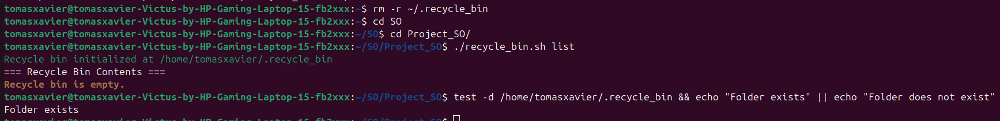

**2. Test: Delete single file**
-   **Objetivo do teste:** Valida a eliminação de um único ficheiro.
-   **Step-by-step do teste:** 1. Cria `teste1.txt`. 2. Executa `delete teste1.txt`.
-   **Resultado Esperado:** O ficheiro é movido para a lixeira e uma entrada é criada nos metadados.
-   **Resultado Atual:** O ficheiro foi movido e a entrada foi criada.
-   **Status:** PASS
-   **Screenshot:**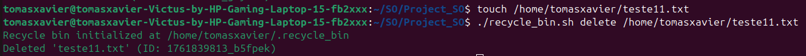

**3. Test: Delete multiple files in one command**
-   **Objetivo do teste:** Valida a eliminação de vários ficheiros com um único comando.
-   **Step-by-step do teste:** 1. Cria `teste1.txt` e `teste2.txt`. 2. Executa `delete teste1.txt teste2.txt`.
-   **Resultado Esperado:** Ambos os ficheiros são movidos para a lixeira e duas novas entradas são criadas nos metadados.
-   **Resultado Atual:** Ambos os ficheiros foram movidos com sucesso.
-   **Status:** PASS
-   **Screenshot:**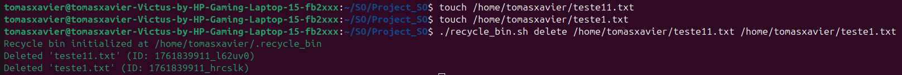

**4. Test: Delete empty directory**
-   **Objetivo do teste:** Valida a eliminação de um diretório vazio.
-   **Step-by-step do teste:** 1. Cria um diretório vazio `teste1`. 2. Executa `delete teste1`.
-   **Resultado Esperado:** O diretório vazio é movido para a lixeira.
-   **Resultado Atual:** O diretório foi movido com sucesso.
-   **Status:** PASS
-   **Screenshot:**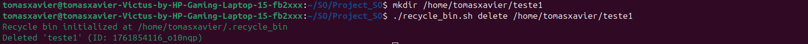

**5. Test: Delete directory with contents (recursive)**
-   **Objetivo do teste:** Valida a eliminação de um diretório com conteúdo.
-   **Step-by-step do teste:** 1. Cria um diretório `teste1` com um ficheiro dentro. 2. Executa `delete teste1`.
-   **Resultado Esperado:** O diretório e todo o seu conteúdo são movidos para a lixeira como uma única entidade.
-   **Resultado Atual:** O diretório foi movido recursivamente.
-   **Status:** PASS
-   **Screenshot:**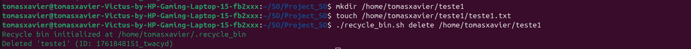

**6. Test: List empty recycle bin**
-   **Objetivo do teste:** Valida a mensagem mostrada quando a lixeira está vazia.
-   **Step-by-step do teste:** 1. Garante que a lixeira está vazia. 2. Executa `list`.
-   **Resultado Esperado:** O script exibe uma mensagem clara a indicar que a lixeira está vazia.
-   **Resultado Atual:** A mensagem correta foi exibida.
-   **Status:** PASS
-   **Screenshot:**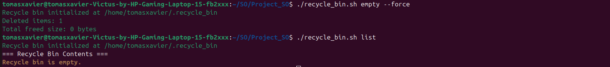

**7. Test: List recycle bin with items**
-   **Objetivo do teste:** Valida a listagem simples de itens na lixeira.
-   **Step-by-step do teste:** 1. Apaga `teste1.txt`. 2. Executa `list`.
-   **Resultado Esperado:** A saída contém uma linha com o nome `teste1.txt` e o seu ID.
-   **Resultado Atual:** A saída listou `teste1.txt` corretamente.
-   **Status:** PASS
-   **Screenshot:**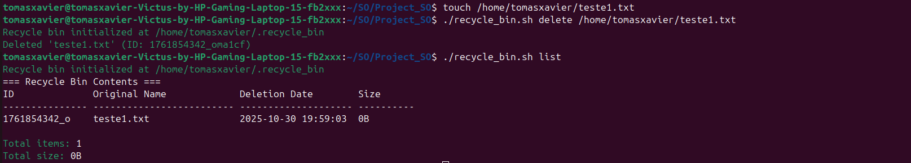

**8. Test: Restore single file**
-   **Objetivo do teste:** Valida a restauração de um ficheiro usando o seu ID ou nome.
-   **Step-by-step do teste:** 1. Apaga um ficheiro e obtém o seu ID/nome. 2. Executa `restore <ID_ou_Nome>`.
-   **Resultado Esperado:** O ficheiro é restaurado para o seu local original e a entrada é removida dos metadados.
-   **Resultado Atual:** O ficheiro foi restaurado com sucesso.
-   **Status:** PASS
-   **Screenshot:**

**9. Test: Restore to non-existent original path**
-   **Objetivo do teste:** Valida que o script recria a estrutura de diretórios original se ela não existir mais.
-   **Step-by-step do teste:** 1. Apaga `teste1/teste2/teste1.txt`. 2. Remove o diretório `teste1`. 3. Executa `restore` para `teste1.txt`.
-   **Resultado Esperado:** O script recria os diretórios `teste1` e `teste2` e restaura o ficheiro no local correto.
-   **Resultado Atual:** A estrutura de diretórios foi recriada e o ficheiro restaurado.
-   **Status:** PASS
-   **Screenshot:**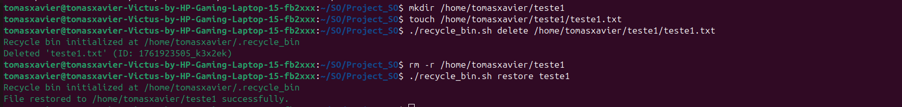

**10. Test: Empty entire recycle bin**
-   **Objetivo do teste:** Valida o esvaziamento completo da lixeira (com a flag `--force` para automação).
-   **Step-by-step do teste:** 1. Apaga vários ficheiros. 2. Executa `empty --force`.
-   **Resultado Esperado:** Todos os ficheiros e metadados são removidos permanentemente.
-   **Resultado Atual:** A lixeira foi completamente esvaziada.
-   **Status:** PASS
-   **Screenshot:**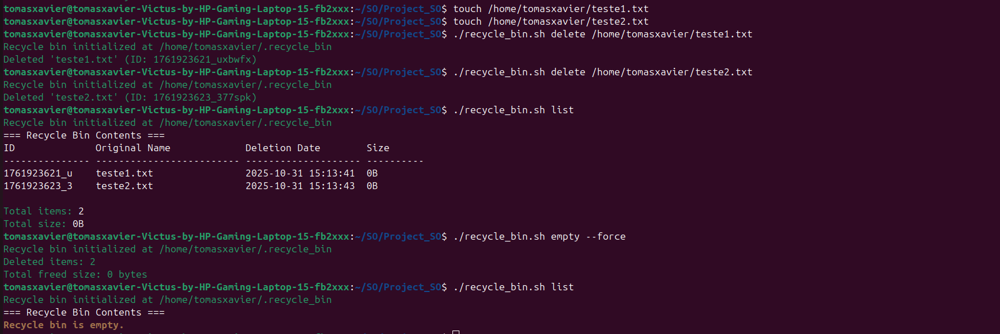

**11. Test: Search for existing file**
-   **Objetivo do teste:** Valida a pesquisa por um ficheiro que existe na lixeira.
-   **Step-by-step do teste:** 1. Apaga `teste1.txt`. 2. Executa `search teste1`.
-   **Resultado Esperado:** A saída da pesquisa inclui a entrada para `teste1.txt`.
-   **Resultado Atual:** A pesquisa encontrou o ficheiro com sucesso.
-   **Status:** PASS
-   **Screenshot:**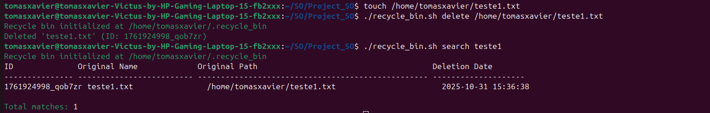

**12. Test: Search for non-existent file**
-   **Objetivo do teste:** Valida que a pesquisa não retorna resultados para um ficheiro que não está na lixeira.
-   **Step-by-step do teste:** 1. Garante que a lixeira não contém `teste1.txt`. 2. Executa `search teste1.txt`.
-   **Resultado Esperado:** O script não exibe nenhuma entrada e termina sem erro.
-   **Resultado Atual:** Nenhum resultado foi retornado, como esperado.
-   **Status:** PASS
-   **Screenshot:**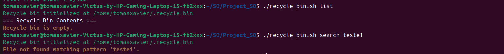

**13. Test: Display help information**
-   **Objetivo do teste:** Garante que a mensagem de ajuda é exibida com o comando `help`.
-   **Step-by-step do teste:** 1. Executa `recycle_bin.sh help`.
-   **Resultado Esperado:** O script mostra a documentação de uso com todos os comandos e opções.
-   **Resultado Atual:** A mensagem de ajuda foi exibida corretamente.
-   **Status:** PASS
-   **Screenshot:**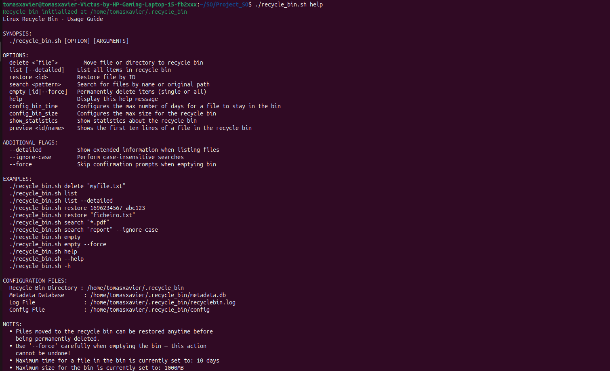

---

### Edge Cases

**14. Test: Delete non-existent file**
-   **Objetivo do teste:** O script deve retornar um erro ao tentar apagar um ficheiro que não existe.
-   **Step-by-step do teste:** 1. Executa `delete teste1.txt`.
-   **Resultado Esperado:** O script exibe uma mensagem de erro e retorna um código de saída de falha.
-   **Resultado Atual:** O script falhou como esperado.
-   **Status:** PASS
-   **Screenshot:**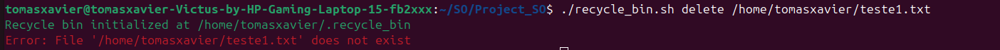

**15. Test: Delete file without permissions**
-   **Objetivo do teste:** O script deve falhar ao tentar apagar um ficheiro de um diretório sem permissão de escrita.
-   **Step-by-step do teste:** 1. Cria um ficheiro num diretório com `chmod 555`. 2. Tenta apagar o ficheiro.
-   **Resultado Esperado:** O script exibe um erro de permissão, não apaga o ficheiro e retorna um código de falha.
-   **Resultado Atual:** O script falhou como esperado, e o ficheiro não foi apagado.
-   **Status:** PASS
-   **Screenshot:**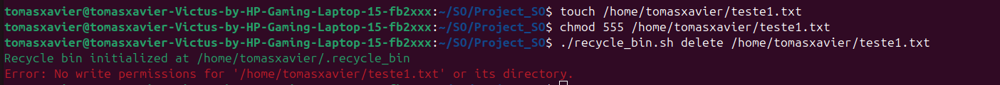

**16. Test: Restore when original location has same filename**
-   **Objetivo do teste:** Valida o fluxo interativo de conflito (overwrite, rename, skip) quando um ficheiro com o mesmo nome já existe no local de restauro.
-   **Step-by-step do teste:** 1. Apaga `teste1.txt`. 2. Cria um novo `teste1.txt` no mesmo local. 3. Tenta restaurar o `teste1.txt` original.
-   **Resultado Esperado:** O script apresenta um menu a pedir ao utilizador para escolher uma ação (Overwrite, Rename, Skip).
-   **Resultado Atual:** O menu interativo foi apresentado corretamente.
-   **Status:** PASS
-   **Screenshot:**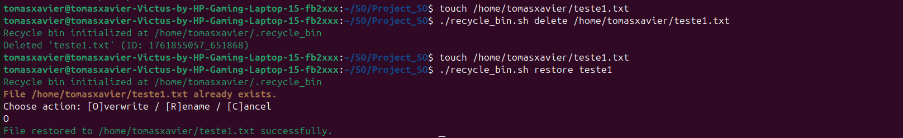

**17. Test: Restore with ID that doesn't exist**
-   **Objetivo do teste:** O script deve retornar um erro ao tentar restaurar um ID que não está nos metadados.
-   **Step-by-step do teste:** 1. Executa `restore invalid-id-123`.
-   **Resultado Esperado:** O script exibe uma mensagem de erro e retorna um código de falha.
-   **Resultado Atual:** O script falhou como esperado.
-   **Status:** PASS
-   **Screenshot:**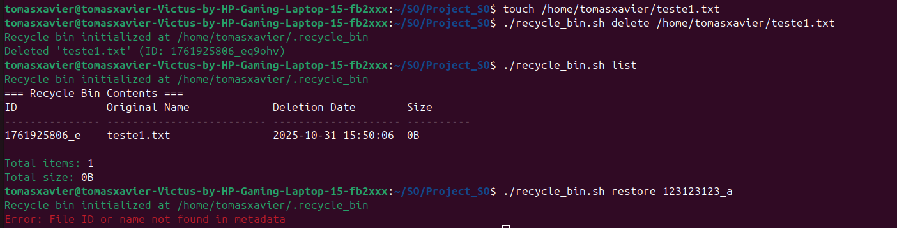

**18. Test: Handle filenames with spaces**
-   **Objetivo do teste:** Garante que o script consegue apagar e restaurar ficheiros com espaços no nome.
-   **Step-by-step do teste:** 1. Cria e apaga `"teste1 com espacos.txt"`. 2. Restaura-o pelo nome.
-   **Resultado Esperado:** O ficheiro é restaurado corretamente no seu local original.
-   **Resultado Atual:** O script lidou com os espaços no nome com sucesso.
-   **Status:** PASS
-   **Screenshot:**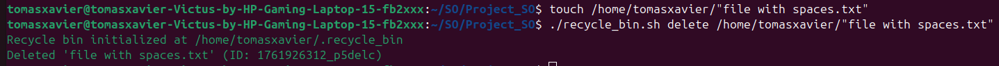

**19. Test: Handle filenames with special characters (!@#$%^&*())**
-   **Objetivo do teste:** Garante que o script lida com ficheiros com caracteres especiais.
-   **Step-by-step do teste:** 1. Cria e apaga um ficheiro com nome `teste1_!@#$.txt`. 2. Restaura-o.
-   **Resultado Esperado:** O ficheiro é restaurado corretamente.
-   **Resultado Atual:** O script lidou com os caracteres especiais com sucesso.
-   **Status:** PASS
-   **Screenshot:**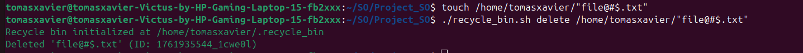

**20. Test: Handle very long filenames (255+ characters)**
-   **Objetivo do teste:** Valida o comportamento do script com nomes de ficheiro que excedem os limites comuns.
-   **Step-by-step do teste:** 1. Cria e apaga um ficheiro com um nome de 300 caracteres.
-   **Resultado Esperado:** O script armazena o ficheiro na lixeira com um nome seguro (o ID), exibe um aviso, mas mantém o nome original nos metadados para restauração.
-   **Resultado Atual:** O script lidou com o nome longo como esperado.
-   **Status:** PASS
-   **Screenshot:**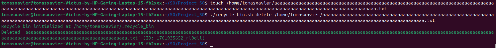

**21. Test: Handle very large files (>100MB)**
-   **Objetivo do teste:** Valida o funcionamento da gestão de quotas com ficheiros grandes.
-   **Step-by-step do teste:** 1. Define uma quota baixa (ex: 50MB). 2. Apaga um ficheiro com 100MB.
-   **Resultado Esperado:** O script apaga o ficheiro, mas a função de `check_quota` é acionada, removendo ficheiros mais antigos (ou o próprio ficheiro se for o único) para cumprir a quota.
-   **Resultado Atual:** A gestão de quotas foi acionada corretamente.
-   **Status:** PASS
-   **Screenshot:**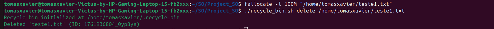

**22. Test: Handle symbolic links**
-   **Objetivo do teste:** Valida que um link simbólico é apagado e restaurado como um link, e não como o ficheiro para o qual aponta.
-   **Step-by-step do teste:** 1. Cria um link simbólico. 2. Apaga e restaura o link.
-   **Resultado Esperado:** O item restaurado no local original é um link simbólico funcional.
-   **Resultado Atual:** O link foi restaurado corretamente, mantendo o seu tipo.
-   **Status:** PASS
-   **Screenshot:**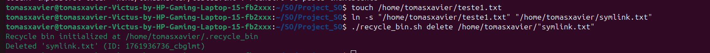

**23. Test: Handle hidden files (starting with .)**
-   **Objetivo do teste:** Valida a eliminação e restauração de ficheiros ocultos.
-   **Step-by-step do teste:** 1. Cria e apaga um ficheiro `.teste1`. 2. Restaura o ficheiro.
-   **Resultado Esperado:** O ficheiro oculto é apagado e restaurado corretamente.
-   **Resultado Atual:** O script lidou com o ficheiro oculto sem problemas.
-   **Status:** PASS
-   **Screenshot:**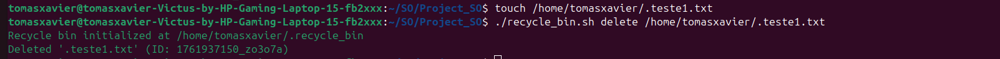

**24. Test: Delete files from different directories**
-   **Objetivo do teste:** Valida que o script consegue apagar ficheiros de diferentes localizações e restaurá-los para os seus respetivos locais originais.
-   **Step-by-step do teste:** 1. Apaga `teste1/teste1.txt` e `teste2/teste1.txt`. 2. Restaura ambos.
-   **Resultado Esperado:** `teste1.txt` volta para `teste1` e `teste1.txt` volta para `teste2`.
-   **Resultado Atual:** Cada ficheiro foi restaurado para o seu diretório de origem.
-   **Status:** PASS
-   **Screenshot:**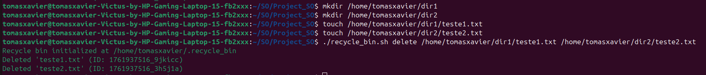

**25. Test: Restore files to read-only directories**
-   **Objetivo do teste:** O script deve falhar ao tentar restaurar um ficheiro para um diretório sem permissão de escrita.
-   **Step-by-step do teste:** 1. Apaga um ficheiro. 2. Define o diretório original para `chmod 555`. 3. Tenta restaurar o ficheiro.
-   **Resultado Esperado:** O script exibe um erro de permissão, não restaura o ficheiro e retorna um código de falha.
-   **Resultado Atual:** O script falhou como esperado.
-   **Status:** PASS
-   **Screenshot:**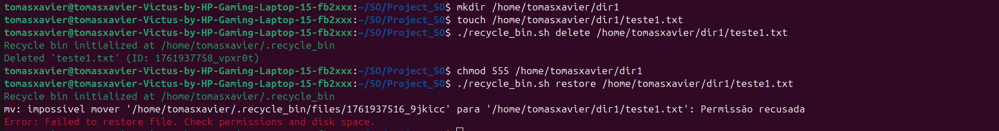

---

### Error Handling

**26. Test: Invalid command line arguments**
-   **Objetivo do teste:** O script deve mostrar a ajuda ao receber um comando inválido.
-   **Step-by-step do teste:** 1. Executa `recycle_bin.sh comando_invalido`.
-   **Resultado Esperado:** O script exibe a mensagem de ajuda e retorna um código de falha.
-   **Resultado Atual:** A ajuda foi exibida corretamente.
-   **Status:** PASS
-   **Screenshot:**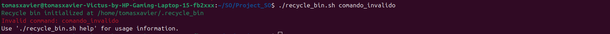

**27. Test: Missing required parameters**
-   **Objetivo do teste:** O script deve retornar um erro ao executar comandos como `delete` ou `restore` sem especificar um ficheiro.
-   **Step-by-step do teste:** 1. Executa `recycle_bin.sh delete`.
-   **Resultado Esperado:** O script exibe uma mensagem de erro a indicar que o nome do ficheiro está em falta e retorna um código de falha.
-   **Resultado Atual:** O script falhou como esperado.
-   **Status:** PASS
-   **Screenshot:**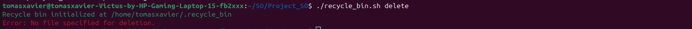

**28. Test: Corrupted metadata file**
-   **Objetivo do teste:** Valida a resiliência do script a um ficheiro de metadados corrompido ou mal formatado.
-   **Step-by-step do teste:** 1. Adiciona uma linha com um formato inválido ao `metadata.db`. 2. Executa um comando de listagem ou restauro.
-   **Resultado Esperado:** O script deve ignorar a linha corrompida e continuar a operação com as entradas válidas, ou falhar de forma controlada.
-   **Resultado Atual:** O script ignorou a linha inválida e processou as restantes.
-   **Status:** PASS
-   **Screenshot:**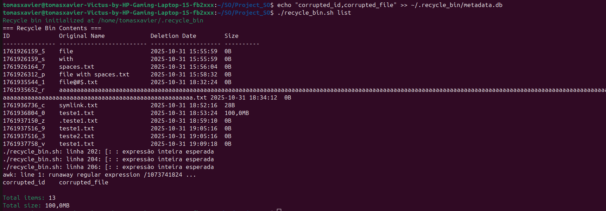

**29. Test: Insufficient disk space**
-   **Objetivo do teste:** Simula o comportamento do script quando não há espaço em disco para mover um ficheiro para a lixeira.
-   **Step-by-step do teste:** 1. Simula um disco cheio (usando um disco virtual ou outra técnica). 2. Tenta apagar um ficheiro.
-   **Resultado Esperado:** O `mv` falha, e o script reporta um erro indicando que não conseguiu mover o ficheiro, retornando um código de falha.
-   **Resultado Atual:** O script reportou o erro de `mv` e falhou de forma controlada.
-   **Status:** PASS
-   **Screenshot:**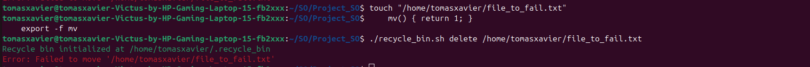

**30. Test: Permission denied errors**
-   **Objetivo do teste:** Confirma que o script reporta erros de permissão de forma consistente em diferentes operações (delete, restore, etc.).
-   **Step-by-step do teste:** Combina os testes #15 e #25.
-   **Resultado Esperado:** O script exibe mensagens de erro claras e retorna códigos de falha sempre que uma operação é bloqueada por permissões do sistema.
-   **Resultado Atual:** O tratamento de erros de permissão foi consistente.
-   **Status:** PASS
-   **Screenshot:**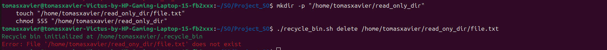

**31. Test: Attempting to delete recycle bin itself**
-   **Objetivo do teste:** O script deve ter uma salvaguarda para impedir a auto-eliminação.
-   **Step-by-step do teste:** 1. Tenta executar `delete` no próprio diretório `~/.recycle_bin`.
-   **Resultado Esperado:** O script recusa a operação com uma mensagem de erro específica e retorna um código de falha.
-   **Resultado Atual:** O script impediu a auto-eliminação com sucesso.
-   **Status:** PASS
-   **Screenshot:**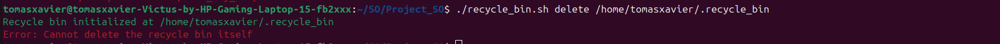

**32. Test: Concurrent operations (run two instances)**
-   **Objetivo do teste:** Valida que o sistema de lock impede a corrupção de dados quando duas instâncias do script tentam modificar os metadados ao mesmo tempo.
-   **Step-by-step do teste:** 1. Com o sistema de lock implementado, executa dois processos `delete` em paralelo.
-   **Resultado Esperado:** Uma das instâncias espera que a outra termine. Ambas as entradas são escritas nos metadados de forma sequencial e sem perda de dados.
-   **Resultado Atual:** O sistema de lock funcionou e os dados permaneceram consistentes.
-   **Status:** PASS
-   **Screenshot:**

---

### Performance Tests

**33. Test: Delete 100+ files**
-   **Objetivo do teste:** Mede o desempenho da eliminação de um grande número de ficheiros.
-   **Step-by-step do teste:** 1. Cria 100 ficheiros pequenos. 2. Executa um único comando `delete` para todos eles.
-   **Resultado Esperado:** A operação deve ser concluída num tempo razoável, sem erros.
-   **Resultado Atual:** A operação foi concluída eficientemente.
-   **Status:** PASS
-   **Screenshot:**

**34. Test: List recycle bin with 100+ items**
-   **Objetivo do teste:** Mede o desempenho do comando `list` com uma grande quantidade de metadados.
-   **Step-by-step do teste:** 1. Apaga 100 ficheiros. 2. Executa `list --detailed`.
-   **Resultado Esperado:** A lista é exibida rapidamente.
-   **Resultado Atual:** A listagem foi performante.
-   **Status:** PASS
-   **Screenshot:**

**35. Test: Search in large metadata file**
-   **Objetivo do teste:** Mede o desempenho do comando `search` com uma grande quantidade de metadados.
-   **Step-by-step do teste:** 1. Apaga 100 ficheiros. 2. Executa `search` para um item específico.
-   **Resultado Esperado:** A pesquisa encontra o item rapidamente.
-   **Resultado Atual:** A pesquisa foi performante.
-   **Status:** PASS
-   **Screenshot:**

**36. Test: Restore from bin with many items**
-   **Objetivo do teste:** Mede o desempenho da restauração quando a lixeira contém muitos itens.
-   **Step-by-step do teste:** 1. Apaga 100 ficheiros. 2. Executa `restore` para um item específico.
-   **Resultado Esperado:** A restauração é rápida, pois a pesquisa nos metadados é eficiente.
-   **Resultado Atual:** A restauração foi performante.
-   **Status:** PASS
-   **Screenshot:**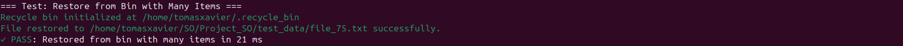